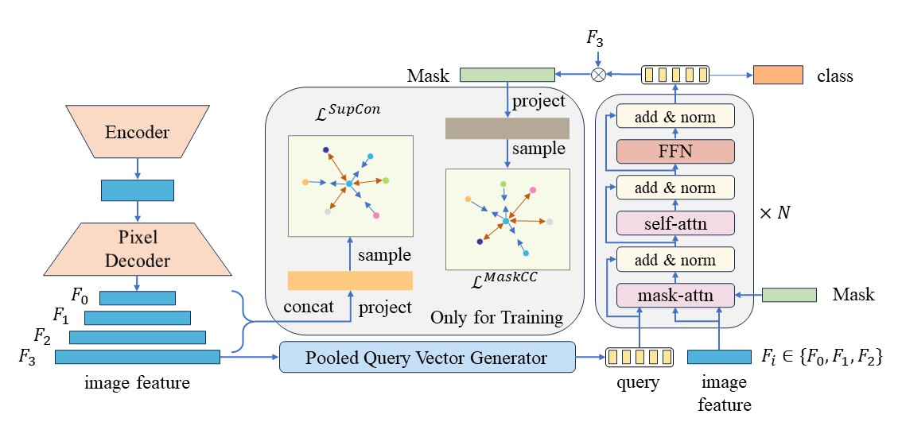

# Mask-Consistent Contrastive Learning


## Introduction
The repository contains official Pytorch implementations of training and evaluation codes for Mask-Consistent Contrastive Learning.

## Installation
1. Follow [tutorial](https://pytorch.org/get-started/) to install pytorch1.11.0(or newer version) and cudatookit.
2. Install mmcv, mmengine, mmcls and mmdet using MIM.
```shell
pip install -U openmim
mim install mmengine
mim install "mmcv==2.0.0rc3"
mim install "mmcls==1.0.0rc4"
mim install "mmdet==3.0.0rc4"
```
3. Install mmsegv1.0.0rc2 from source.
```shell
git clone https://github.com/CVIU-CSU/MaskCC.git
cd MaskCC
pip install -v -e .
```
4. Prepare datasets following [tutorial](https://github.com/open-mmlab/mmsegmentation/blob/v1.0.0rc2/docs/en/user_guides/2_dataset_prepare.md#prepare-datasets).
## Training
Cityscapes
```shell
CUDA_VISIBLE_DEVICES=0,1,2,3,4,5,6,7 PORT=29513 bash tools/dist_train.sh configs/maskcc/maskcc_r50_8xb2-90k_cityscapes-512x1024.py 8
```
ADE20K:
```shell
CUDA_VISIBLE_DEVICES=0,1,2,3 PORT=29513 bash tools/dist_train.sh configs/maskcc/maskcc_r50_4xb4-160k_ade20k-512x512.py 4
```
PASCAL-Context
```shell
CUDA_VISIBLE_DEVICES=0,1,2,3 PORT=29513 bash tools/dist_train.sh configs/maskcc/maskcc_r50_4xb4-60k_pascal-context_480x480.py 4
```
COCO-Stuff10k
```shell
CUDA_VISIBLE_DEVICES=0,1,2,3 PORT=29513 bash tools/dist_train.sh configs/maskcc/maskcc_r50_4xb4-60k_cocostuff_480x480.py 4
```
## Evalution 
For single-scale test:
```shell
CUDA_VISIBLE_DEVICES=0,1,2,3,4,5,6,7 PORT=29513 bash tools/dist_test.sh configs/maskcc/maskcc_r50_8xb2-90k_cityscapes-512x1024.py 8
```
For multi-scale test:
The multi-scale test for mask2former is not supported in mmsegv1.0.0rc2.

## Results
|     Method      |  Backbone  | Train Set | Eval Set | Batch | Iters | mIoU |                            Config                            |
| :-------------: | :--------: | :-------: | :------: | :---: | :---: | :---: | ------------------------------------------------------------ |
| Mask2Former | ResNet50 | Cityscapes train | Cityscapes val | 8x2  |  90K  | 79.4 | [config](./configs/mask2former/mask2former_r50_8xb2-90k_cityscapes-512x1024.py) |
| Mask2Former+MaskCC | ResNet50 | Cityscapes train | Cityscapes val | 8x2  |  90K  | 80.9 | [config](./configs/maskcc/maskcc_r50_8xb2-90k_cityscapes-512x1024.py) |
| Mask2Former | ResNet50 | ADE20K train | ADE20K val | 4x4  |  160K  | 47.2 | [config](./configs/mask2former/mask2former_r50_8xb2-160k_ade20k-512x512.py) |
| Mask2Former+MaskCC | ResNet50 | ADE20K train | ADE20K val | 4x4  |  160K  | 48.4 | [config](./configs/maskcc/maskcc_r50_4xb4-160k_ade20k-512x512.py) |
| Mask2Former | ResNet50 | PASCAL-Context train | PASCAL-Context val | 4x4  |  60K  | 54.8 | [config](./configs/mask2former/mask2former_r50_4xb4-60k_pascal-context_480x480.py) |
| Mask2Former+MaskCC | ResNet50 | PASCAL-Context train | PASCAL-Context val | 4x4  |  60K  | 55.3 | [config](./configs/maskcc/maskcc_r50_4xb4-60k_pascal-context_480x480.py) |
| Mask2Former | ResNet50 | COCO-Stuff10k train | COCO-Stuff10k val | 4x4  |  60K  | 40.0 | [config](./configs/mask2former/mask2former_r50_4xb4-60k_cocostuff_480x480.py) |
| Mask2Former+MaskCC | ResNet50 | COCO-Stuff10k train | COCO-Stuff10k val | 4x4  |  60K  | 41.2 | [config](./configs/maskcc/maskcc_r50_4xb4-60k_cocostuff_480x480.py) |

## Todo
- [x] MaskCC code
- [x] Configs
- [x] Detailed readme
- [ ] Citation

